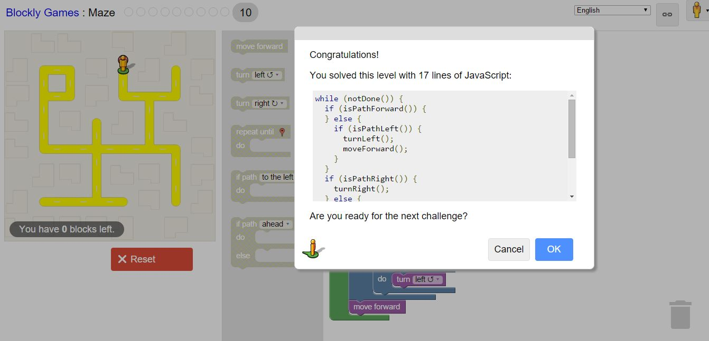

#Lab 1

##10 Criteria of Open Source
Open source doesn't only mean that you have access to the source code. Open source means that you can modify and change the source code in whichever way you want. The software should not decriminate against people or fields of endeavor. The license also cannot insist all other programs of the same medium to also be open source.

##Smart Questions
Before you actually ask the question you have, search for your problem online or try your hardest to figure it out before hitting a wall. When you ask a question on a forum, make sure that it is off topic, same level of difficulty as the other questions asked on the forum, and try not to cross-post. Search then ask on Stack Exchange since it is very likely that someone else has had the same question. Use a meaningful header when you post a question so that it explains your problem better.

1. Make sure you are familiar with the language/vocabulary required to communicate your problem correctly.
2. If your question is on a certain topic, learn about the topic beforehand to make sure that you can't solve your problem from that. 

##Regex

##RegexCrossword

##Blockly

##Reflection
A project that has been on my mind for a while now is to create my own game. As the idea stands in my head, I want it to be a time progression game, where the player gets better at the game as long as they leave it open (otherwise known as an idle game). I would like to set up a finished idle game and allow for extensions and plugins to be created by people so that they can play the game how they would like to. 
