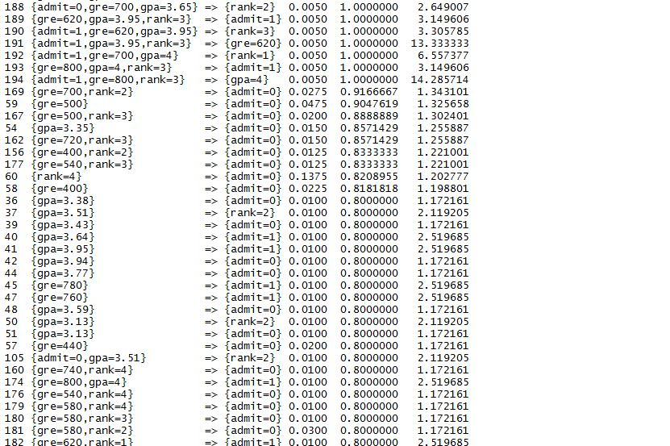
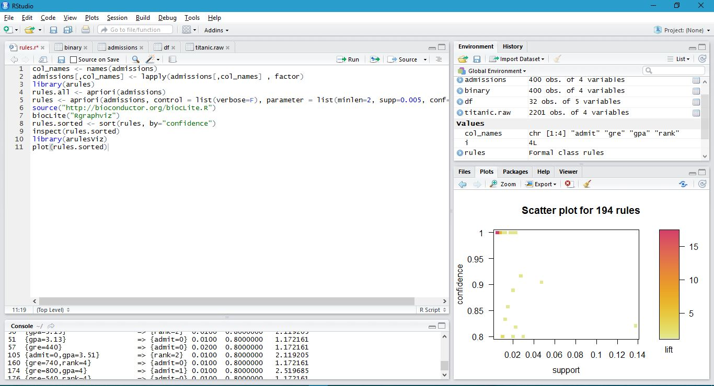

#Lab 8 Report
=====

##Output + Plot

##Status Report

The group has begun to hold weekly meeting, where we divide up the work
for the initial phase of the project. Also, all of us have cloned the forked repository and have
started trying to familiarize ourselves with the code in the repository.  By this weekend I hope to begin
starting my task of refactoring, while everyone else tries either add new features or fix the styling of the page. 